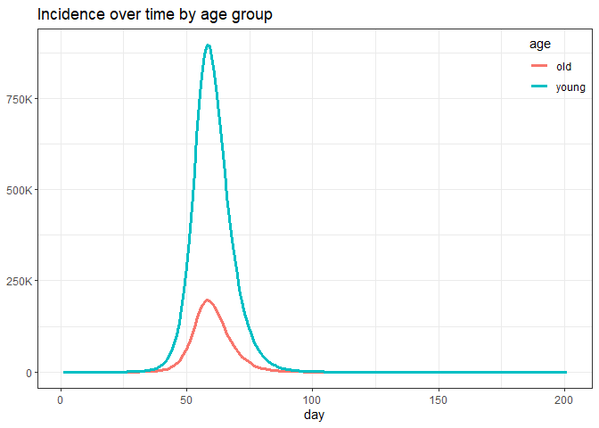
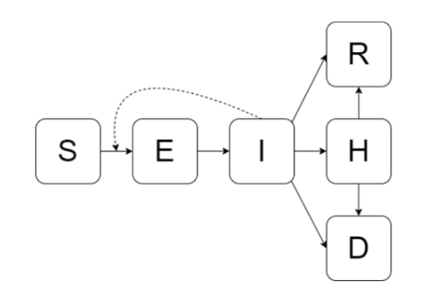

<!-- README.md is generated from README.Rmd. Please edit that file -->

# EPACmodel

<!-- badges: start -->
<!-- badges: end -->

This package implements the Early Pandemic Age-Structured Compartmental
(EPAC) model developed by Michael WZ Li
([@wzmli](https://github.com/wzmli)) and Irena Papst
([@papsti](https://github.com/papsti)) from the Public Health Risk
Sciences Division of the Public Health Agency of Canada
([@phac-nml-phrsd](https://github.com/phac-nml-phrsd)) using
[`macpan2`](https://github.com/canmod/macpan2) modelling software.

The goal of this package is to document the iterations of this model,
and package them so that they can easily be pulled into project-specific
pipelines to produce modelling outputs.

## Installation

The latest release of `EPACmodel` is version 1.1.0, and can be installed
with:

``` r
remotes::install_github("phac-nml-phrsd/EPACmodel@v1.1.0")
```

You can install the development version of `EPACmodel` with:

``` r
remotes::install_github("phac-nml-phrsd/EPACmodel")
```

## Getting started guide

``` r
library(EPACmodel)
#> 
#> Attaching package: 'EPACmodel'
#> The following object is masked from 'package:stats':
#> 
#>     simulate
```

### Set up model simulator

To work with a model, we need to set up its simulator. A simulator in
`macpan2` is an object that includes model structure (state names, flow
expressions, etc.) along with a set of variable values (such as
components of flow rates, initial states) that ensure it is ready to
produce simulation results.

This package includes several models whose simulators can quickly and
easily be retrieved. Available models include:

``` r
list_models()
#> [1] "five-year-age-groups" "old-and-young"
```

To get this model’s simulator, we simply call:

``` r
model.name <- "old-and-young"
model_simulator <- make_simulator(
  model.name = model.name
)
```

By default, `make_simulator()` will attach a set of default values for
variables in the model (components of flow rates, initial states, etc.)
to the model structure. It will also set a default number of time steps.
You can see all default values easily as follows:

``` r
# load default values (initial state, params, etc.)
default.values = get_default_values(model.name)
```

The definition of each default value is documented in each model’s
README (appended below in the [Available models](#available-models)
section).

Any of these values can be changed by passing the optional
`update.values` argument to `make_simulator()`. We recommend first
loading the entire list of default values and extracting the specific
value (list element) that you want to update, editing the numeric
quantity as desired, and then passing the modified list element to
`make_simulator()` via the `update.values` argument, to ensure that
format of value is preserved to remain compatible with the model
definition and `macpan2`:

``` r
# get default initial state
default.state = default.values$state
print("default state:")
#> [1] "default state:"
print(default.state)
#>      S_y      R_y      E_y      I_y      H_y      D_y      S_o      R_o 
#> 31400000        0        1        1        0        0  6900000        0 
#>      E_o      I_o      H_o      D_o 
#>        1        1        0        0

# move some young susceptibles to the recovered class
new.state = default.state # copy over default value to preserve format
new.state["R_y"] = 1000 # modify specific elements
new.state["S_y"] = new.state["S_y"] - new.state["R_y"] # modify specific elements
print("new state:")
#> [1] "new state:"
print(new.state)
#>      S_y      R_y      E_y      I_y      H_y      D_y      S_o      R_o 
#> 31399000     1000        1        1        0        0  6900000        0 
#>      E_o      I_o      H_o      D_o 
#>        1        1        0        0

# use updated state to make a new simulator 
new_model_simulator = make_simulator(
  model.name = model.name,
  updated.values = list(state = new.state)
)
```

### Simulate a model

To simulate a model, just use the `simulate()` function:

``` r
sim.output = simulate(model_simulator)
```

Since the model simulator already has all required values attached, all
required calculations can be performed to produce the simulation
results.

For all models, simulation outputs are stored in a data frame with
columns

    time | state_name | value_type | value

The output `value_types` are

- `state`: the number of individuals in given state at a given time,
- `total_inflow`: the total inflow into a given compartment at a given
  time.

For instance, here is the number of individuals in each state,
stratified by the two age groups `y` (young) and `o` (old), at time 10:

``` r
(sim.output
 |> dplyr::filter(value_type == 'state', time == 10)
)
#>    time state_name value_type        value
#> 1    10        S_y      state 3.139988e+07
#> 2    10        E_y      state 7.888172e+01
#> 3    10        I_y      state 2.644023e+01
#> 4    10        H_y      state 5.068467e+00
#> 5    10        R_y      state 7.329988e+00
#> 6    10        D_y      state 7.329988e-01
#> 7    10        S_o      state 6.899959e+06
#> 8    10        E_o      state 2.621033e+01
#> 9    10        I_o      state 9.945527e+00
#> 10   10        H_o      state 2.328352e+00
#> 11   10        R_o      state 3.674943e+00
#> 12   10        D_o      state 3.674943e-01
```

The total inflow into $I$ compartments can be used to extract disease
incidence by age over time:

``` r
(sim.output
 |> dplyr::filter(
   stringr::str_detect(state_name, "^I"),
   value_type == 'total_inflow'
 )
 |> head()
)
#>   time state_name   value_type     value
#> 1    1        I_y total_inflow 0.1000000
#> 2    1        I_o total_inflow 0.1000000
#> 3    2        I_y total_inflow 0.0990000
#> 4    2        I_o total_inflow 0.0990000
#> 5    3        I_y total_inflow 0.1455143
#> 6    3        I_o total_inflow 0.1195285
```

We can plot the results using standard data manipulation and plotting
tools, like `dplyr` and `ggplot2`:



### Scenarios

By default, `make_simulator()` will initialize a base model. Some model
definitions include optional scenarios on top of the base model, such as
interventions modelled through time-varying model parameters. For
instance, one could simulate a stay-at-home order by reducing the
transmission rate on a given date by some amount.

One can specify the `scenario.name` argument in `make_simulator()` to
attach the required model structure to simulate a given scenario type.
Scenario options and descriptions are catalogued in each model’s README
(appended below in the [Available models](#available-models) section).

Here we demonstrate the `old-and-young` model with the
`transmission-intervention` scenario. By default, this scenario reduces
the transmission rate in each age group to 50% then 10% of its original
value on days 30 and 40, respectively:

``` r
values = get_default_values("old-and-young")

values[
  c("intervention.day", "trans.factor.young", "trans.factor.old")
]
#> $intervention.day
#> [1] 40 50
#> 
#> $trans.factor.young
#> [1] 0.5 0.1
#> 
#> $trans.factor.old
#> [1] 0.5 0.1
```

We specify that we want to use the `change-transmission` scenario in the
call to `make_simulator()`:

``` r
model_simulator <- make_simulator(
  model.name = "old-and-young",
  scenario.name = "change-transmission"
)

sim.output = simulate(model_simulator)
```


## Available models

### `old-and-young` model

This version of the model features a basic epidemiological structure
stratified with two age groups: young and old. The epidemiological
compartments are:

- $S$: susceptible
- $E$: exposed
- $I$: infected
- $H$: hospitalized
- $R$: recovered
- $D$: dead

The flows within each age group are as follows:



The solid lines indicate flows between compartments and the dashed lines
indicate when a compartment is involved in calculating a flow rate.

#### Age-based transmission

The force of infection for age group $i$, $\lambda_i$, which is the
per-capita rate of flow of age $i$ susceptibles into the exposed class
(of the same age), is modelled as

$$
\lambda_i = \sum_{j} c_{ij} \beta_j I_j/N_j
$$

where

- $c_{ij}$ is the contact rate of a susceptible in age group $i$ with an
  infected in age group $j$,
- $\beta_j$ is the transmission rate for age group $j$,
- $I_j$ is the number of infectious individuals in age group $j$,
- $N_j$ is the population size of age group $j$.

#### Input values

There are several input values for the base model. Some inputs are
stratified by age group (with suffix `_y` for young and `_o` for old).
We use the generic suffix `_j` to denote inputs for age group `j` in the
list below:

- `state`: a named list of the initial state for the simulation, where
  the name of each state follows the pattern `[epi-state]_j`
- `params`: a named list of model parameters used to compute flow rates,
  including
  - `transmission_j`: transmission rate, denoted by $\beta_j$ in the
    force of infection above,
  - `c_ij`: contact rate, denoted by $c_{ij}$ in the force of infection
    above,
  - `progression_j`: rate of flow from exposed to infectious,
  - `recovery_j`: rate of flow from infectious to recovered,
  - `hospitalization_j`: rate of flow from infectious to hospitalized,
  - `discharge_j`: rate of from from hospitalized to recovered,
  - `deathH_j`: rate of flow from hospitalized to dead,
  - `deathI_j`: rate of flow from infectious to dead.

Optional (scenario-specific) input values are documented in the [next
section](#available-scenarios-tagm).

#### Available scenarios

##### `change-transmission` scenario

This scenario simulates two changes in the age-dependent transmission
rates on specific days.

Intervention days are specified through the `intervention.day` input
value. The default values yield changes on days 40 and 50.

Scalar multiples of the original transmission rates are specified via
the `trans.factor.young` and `trans.factor.old` input values, for the
young and old, respectively. The default values reduce the transmission
rate to 50% then 10% of the original value across both age groups.

### `five-year-age-group` model

This version of the model features a basic epidemiological structure
stratified with five-year age groups up to age 80. The epidemiological
compartments are:

- $S$: susceptible
- $E$: exposed
- $I$: infected
- $H$: hospitalized
- $R$: recovered
- $D$: dead

The flows within each age group are as follows:


The solid lines indicate flows between compartments and the dashed lines
indicate when a compartment is involved in calculating a flow rate.

#### Age-based transmission

The force of infection for age group $i$, $\lambda_i$, which is the
per-capita rate of flow of age $i$ susceptibles into the exposed class
(of the same age), is modelled as

The force of infection for occurs in an age-based way, as a proxy for
population heterogeneity. The transmission rate for susceptibles of age
`i` and infectious individuals of age `j` is calculated as

$$
\lambda_i = \tau \sum_{j} p_{ij} \hat{c}_j I_j/N_j 
$$

where

- $\tau$ is the transmissibility of the pathogen, quantified as the
  proportion of contacts between a susceptible and an infectious
  individual that yield transmission (independent of age),
- $p_{ij}$ is the proportion of age group $i$’s contacts that occur with
  age group $j$,
- $\hat{c}_j$ is the average contact rate for individuals in age group
  $j$ (across all ages),
- $I_j$ is the number of infectious individuals in age group $j$ (at a
  given time),
- $N_j$ is the population size of age group $j$.

The average contact rate vector ($\hat{c}$) and the contact proportion
matrix ($\left[p_{ij}\right]$) are both generated using a weighted
average of four setting-based component contact matrices, derived by
[Mistry et al
(2021)](https://www.nature.com/articles/s41467-020-20544-y), which
reflect contacts in households, workplaces, schools, and community (all
other contacts outside of the three previous settings). The weights are
the average overall contact rate per setting. This weighted average
generates an overall contact matrix. The row sums of this matrix give
the average contact rate vector, $\left[\hat{c}_j\right]$, and the
row-normalized version of this matrix is the contact proportion matrix
($\left[p_{ij}\right]$).

#### Input values

There are several input values for the base model. Some inputs are
stratified by age group (with suffix `.lb[digit]`, where `[digit]`
denotes the lower bound of the age group. For example, `.lb50` denotes
the `50-54` age group. We use the generic suffix `.j` to denote inputs
for age group `j` in the list below:

- `state`: a named list of the initial state for the simulation, where
  the name of each state follows the pattern `[epi-state].j`
- `flow`: a named list of flow rates, including
  - `progression.j`: rate of flow from exposed to infectious,
  - `recovery.j`: rate of flow from infectious to recovered,
  - `hospitalization.j`: rate of flow from infectious to hospitalized,
  - `discharge.j`: rate of from from hospitalized to recovered,
  - `death_H.j`: rate of flow from hospitalized to dead,
  - `death_I.j`: rate of flow from infectious to dead
- `transmissibility`: transmissibility proportion, denoted by $\tau$ in
  the force of infection above,
- `setting.weight`: vector of weights for the setting-specific component
  contact matrices, where each weight gives the average contact rate per
  setting across all ages, as described above.

Optional (scenario-specific) input values are documented in the [next
section](#available-scenarios-fyagm).

#### Available scenarios

##### `change-contacts` scenario

This scenario enables the simulation of an intervention that affects the
age-based contact patterns starting on a specified day from the start of
the simulation (the “intervention day”).

The intervention day is specified with the `intervention.day` input
value. The default value simulates a stay-at-home order starting on day
25.

An intervention involves using a new contact matrix starting on the
intervention day, which is generated with new setting weights, specified
in the `setting.weight.new` input value. The default values reflect
closing all schools, 50% of workplaces, and reducing community contacts
by 75% from the default `setting.weight` input value.

The user can also change overall transmissibility of the pathogen
starting on the intervention day to some scalar multiple of the original
value via the `trans.factor` input value. The default values include
`trans.factor = 1`, so no change to underlying transmissibility.

## Locally-defined model files

You can use the functions in this package with model files defined
locally in your own projects, provided they fit the `EPACmodel`
paradigm. It is easiest to start with files from a packaged model as a
guide (like the [`five-year-age-groups` model
files](https://github.com/phac-nml-phrsd/EPACmodel/tree/v1.0.0/inst/models/five-year-age-groups)).

Here is a list of requirements for locally-defined models:

- Models are defined in a `models/[model-name]` subdirectory of the main
  project folder (`[model-name]` is a placeholder)
- The following files must appear in `models/[model-name]` to define a
  model:
  - The standard set of model definition files [required by
    `macpan2`](https://canmod.github.io/macpan2/articles/quickstart),
    including:
    - `variables.csv`
    - `derivations.json`
    - `settings.json`
    - `flows.csv`
  - `default_values.rds`, containing a `values` list that includes
    specific numeric values for all quantities that must be specified
    for a model simulator to run (*e.g.* parameter values, initial
    conditions, etc.)
  - `simulator-expression.R`, containing an expression for the model
    simulator as specified by a `macpan2::TMBSimulator()` object
- The following files may optionally appear in `models/[model-name]` to
  define a model:
  - `run-before-model.R`, including any code that should be run before
    the simulator expression, to help initialize it
  - `run-after-model.R`, including any code that should be run after the
    simulator expression, to modify it, including any scenario-based
    modifications
  - `README.Rmd`, describing the model and any defined scenarios
- Any helper functions required to generate a model simulator should
  appear in `R/helpers_[model-name].R`, where `R/` is a subdirectory of
  the main project folder.

One can use package functions to work with locally-defined models by
using the `local = TRUE` flag:

    list_models(local = TRUE)
    make_simulator(model.name = "my-model", local = TRUE)
